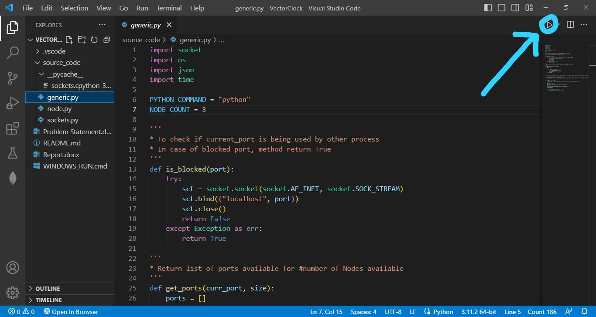

# VectorClock

1. Windows
   Method-1 - "WINDOWS_RUN" cmd file to start execution of implementation.
2. generic.py
   Method-2 - "python source_code\generic.py" command to start execution of implementation.

   
